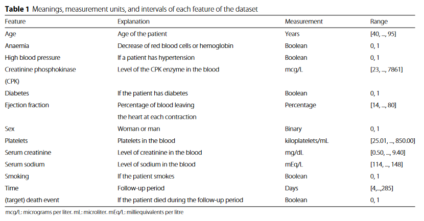
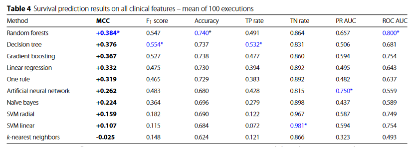
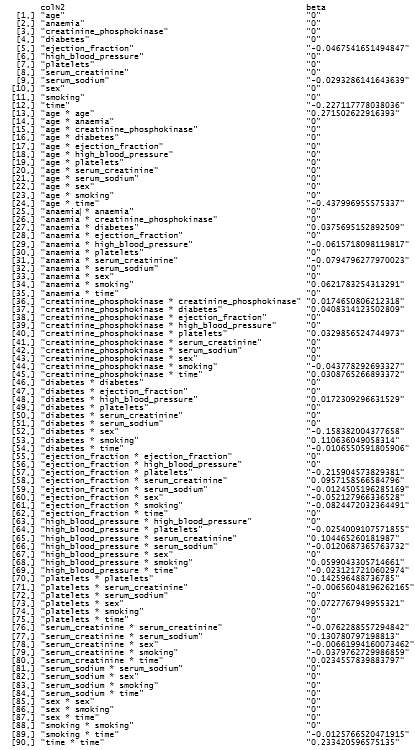

# High-dimensional statistic 2

\
\
\
\
\
\
\
\
\
\
\
\
\
\
\
\
\
\
\
\
\
\
\
\
\
\
\
\

## Table of Contents

-   Lasso Estimator
-   Coordinate Descent Estimator
-   Use on real-life data\
    \
    \
    \
    \
    \
    \
    \
    \
    \
    \
    \
    \
    \
    \
    \
    \
    \
    \
    \
    \
    \
    \
    \
    \
    \
    \
    \
    \
    \
    \
    \
    \

## Lasso-Estimator

```{r}
PolynomialDesign <- function(x.vector, d)
{
  x_len = length(x.vector)
  X = matrix(0,x_len,d+1)
  for (j in 1:x_len){
    for (i in 0:d){
      X[j,i+1] = x.vector[j]^i
    }
  }
  return(X)
}
```

```{r}
# needed to visualize the contour
# x <- vector representing x axis
# y2 <- vector representing y axis
# X <- matrix representing design
# y <- vector representing expected result
norm_pol_des <-function(x,y2,X,y){ 
  n <- dim(X)[1]
  sol <- matrix(0, length(x), length(y2))
  for (i in 1:length(x)){
    for (j in 1:length(y2)){
      sol[i,j] = norm(y-X%*%c(x[i],y2[j]))/n
    }
  }
  return(sol)
}
```

```{r}
grad_ls <- function(X,y, beta){ # calculate gradient
  return(-2*t(X)%*%(y-X%*%beta))
}
```

```{r}
set.seed(1)
# lr <- learning rate
update_beta_n <- function(beta_hat, lr, adapting_lr=FALSE){
  list_beta_hat = beta_hat
  #print(norm(y-X%*%beta_hat))
  for (i in 1:nupdates){
    update <- grad_ls(X,y,beta_hat)*lr
    if (adapting_lr){
      lr = lr*0.8
    }
    beta_hat <- beta_hat - update
    list_beta_hat = rbind(list_beta_hat, t(beta_hat))
    #print(norm(y-X%*%beta_hat))
  }
  return(list_beta_hat)
}
```

\
\
\
\
\
\
\
\

```{r}
n<- 10; d <- 1; nupdates <- 30
beta_hat = runif(d+1, min = -10, max = 10)
X <- PolynomialDesign(runif(n, min = -1, max = 1), d)
regression.vector <- c(2, 2)
y <- X %*% regression.vector
```

\
\
\
\
\
\
\
\

```{r}
adapting_lr <- FALSE
lr=0.01
lr_good <- update_beta_n(beta_hat,lr)
lr=0.001
beta_hat <- runif(d+1, min = -10, max = 10)
lr_small <- update_beta_n(beta_hat,lr)
lr=0.1
beta_hat <- runif(d+1, min = -10, max = 10)
lr_big <- update_beta_n(beta_hat,lr)
lr=0.1
beta_hat <- runif(d+1, min = -10, max = 10)
lr_adap <- update_beta_n(beta_hat,lr,TRUE)
x <- -10:10
y2 <- -10:10
z = norm_pol_des(x,y2,X,y)
cols <- hcl.colors(15, "Temps")
contour(x, y2, z,drawlabels = FALSE, col=cols)
```

```{r}
contour(x, y2, z,drawlabels = FALSE, col=cols)
points(lr_good[,1],lr_good[,2],"l", col="blue1")
points(lr_good[,1],lr_good[,2], col="blue1")
legend(,x = "topleft",2, 4, legend=c("Good learning rate"),  
       fill = c("blue1") 
)
```

\
\
\
\
\
\
\
\

```{r}
contour(x, y2, z,drawlabels = FALSE, col=cols)
points(lr_small[,1],lr_small[,2],"l", col="red")
points(lr_small[,1],lr_small[,2], col="red")
legend(,x = "topleft",2, 4, legend=c("Small learning rate"),  
       fill = c("red") 
)
```

\
\
\
\
\
\
\
\

```{r}
contour(x, y2, z,drawlabels = FALSE, col=cols)
points(lr_big[,1],lr_big[,2],"l", col = "green")
points(lr_big[,1],lr_big[,2], col="green")
legend(,x = "topleft",2, 4, legend=c("High learning rate"),  
       fill = c("green") 
)
```

\
\
\
\
\
\
\
\

```{r}
contour(x, y2, z,drawlabels = FALSE, col=cols)
points(lr_adap[,1],lr_adap[,2],"l", col ="violet")
points(lr_adap[,1],lr_adap[,2], col="violet")
legend(,x = "topleft",2, 4, legend=c("Adaptive learning rate"),  
       fill = c("violet") 
)
```

\
\
\
\
\
\
\
\

```{r}
contour(x, y2, z,drawlabels = FALSE, col=cols)

points(lr_good[,1],lr_good[,2],"l", col="blue1")
points(lr_good[,1],lr_good[,2], col="blue1")
points(lr_small[,1],lr_small[,2],"l", col="red")
points(lr_small[,1],lr_small[,2], col="red")
points(lr_big[,1],lr_big[,2],"l", col = "green")
points(lr_big[,1],lr_big[,2], col="green")
points(lr_adap[,1],lr_adap[,2],"l", col ="violet")
points(lr_adap[,1],lr_adap[,2], col="violet")
legend(,x = "bottomleft",2, 4, legend=c("Good learning rate", "Small learning rate", "High learning rate", "Adaptive learning rate"),  
       fill = c("blue","red", "green", "violet")) 
```

\
\
\
\
\
\
\
\
\
\
\
\
\
\
\
\
\
\
\
\
\
\
\
\
\
\
\
\
\
\
\
\
\
\
\
\
\
\
\
\

## Coordinate Descent Estimator

```{r}
PolynomialDesign <- function(x.vector, d)
{
  x_len = length(x.vector)
  X = matrix(0,x_len,d+1)
  for (j in 1:x_len){
    for (i in 0:d){
      X[j,i+1] = x.vector[j]^i
      #print(i)
    }
  }
  return(X)
}

norm_pol_des <-function(x,y2,X,y){
  n <- dim(X)[1]
  sol <- matrix(0, length(x), length(y2))
  for (i in 1:length(x)){
    for (j in 1:length(y2)){
      sol[i,j] = norm(y-X%*%c(x[i],y2[j]))/n
    }
  }
  return(sol)
}
grad_ls <- function(X,y, beta){
  return(-2*t(X)%*%(y-X%*%beta))
}

SoftThreshholding <- function(z, lambda){
  if (abs(z)<= lambda){
    return (0)
  }
  if(z > lambda){
    return (z - lambda)
  }
  return(z+lambda) 
}

n<- 20; d <- 10; nupdates <- 30
beta_hat = runif(d+1, min = -10, max = 10)
X <- PolynomialDesign(runif(n, min = -1, max = 1), d)
regression.vector <- c(2, 2, rep(0, d-1))
y <- X %*% regression.vector+ rnorm(n)

CreateDesign <-function(n, d){
  X <- PolynomialDesign(runif(n, min = -1, max = 1), d)
  regression.vector <- c(2, 2, rep(0, d-1))
  y <- X %*% regression.vector+ rnorm(n)
  Design <- list(X,y, regression.vector)
  names(Design) <- c("X","y", "beta")
  return(Design)
}

updateCoordinate <- function(beta_hat, coordinate,y,X, lambda){
  xitxi = t(X[,coordinate])%*%X[,coordinate]
  sum_wo_i = 0
  for (i in 1:dim(X)[2]){
    if (i != coordinate){
      sum_wo_i = sum_wo_i + X[,i] * beta_hat[i]
    }
  }
  r_i = y -sum_wo_i
  beta_hat[coordinate] = SoftThreshholding(t(X[,coordinate])%*% r_i / xitxi, lambda/xitxi)
  return(beta_hat)
}

# max_iter <- maximal number of iterations
# vis_beta <- if vis_beta = TRUE a list with betas from every step is returned, otherwise only the beta after max_iter iterations is returned 
# vis_sparsity <- if vis_sparsity = TRUE, for the zero norm of beta from every step is returned, otherwise the beta after max_iter steps is returned
# idx_ones -> if idx_ones = TRUE the coordinate sequence is calculated ones, otherwise new coordinate sequence at each iteration step
LassoCoordinateDescent <- function(X,y,lambda, max_iter = 30, vis_beta = FALSE, vis_sparsity = FALSE, idx_ones = TRUE){
  beta_hat = rep(0, dim(X)[2]) # runif(dim(X)[2], min = -10, max = 10)
  if (vis_beta){
    list_beta_hat = beta_hat
  }
  if (vis_sparsity){
    beta_0 <- rep(0, max_iter)
  }
  index = sample(1:dim(X)[2])
  #regression.vector <- c(1, 1, 1, rep(0, p-3))
  for (i in 1:max_iter){
   # if(i%%1==0){
    #  print(norm(regression.vector-beta_hat,"2"))
    #}
    if(!idx_ones){
      index = sample(1:dim(X)[2])
    }
    #index = 1:1:dim(X)[2]
    for (j in 1:dim(X)[2]){
      beta_hat <- updateCoordinate(beta_hat, index[j],y, X, lambda)
      if (vis_beta){
        list_beta_hat = rbind(list_beta_hat, t(beta_hat))
      }
    }
    if (vis_sparsity){
      beta_0[i] <- sum(beta_hat != 0)
    }
  }
  if (vis_beta){
    return(list_beta_hat)
  }
  if (vis_sparsity){
    return(beta_0)
  }
  return(beta_hat)
}

LassoCoordinateDescentOrdered <- function(X,y,lambda, max_iter = 30, vis_beta = FALSE, vis_sparsity = FALSE){
  beta_hat = rep(0, dim(X)[2]) # runif(dim(X)[2], min = -10, max = 10)
  if (vis_beta){
    list_beta_hat = beta_hat
  }
  if (vis_sparsity){
    beta_0 <- rep(0, max_iter)
  }
  for (i in 1:max_iter){
    index = 1:1:dim(X)[2]
    for (j in 1:dim(X)[2]){
      beta_hat <- updateCoordinate(beta_hat, index[j],y, X, lambda)
      if (vis_beta){
        list_beta_hat = rbind(list_beta_hat, t(beta_hat))
      }
    }
    if (vis_sparsity){
      beta_0[i] <- sum(beta_hat != 0)
    }
  }
  if (vis_beta){
    return(list_beta_hat)
  }
  if (vis_sparsity){
    return(beta_0)
  }
  return(beta_hat)
}
```

```{r}
set.seed(8)
D <- CreateDesign(10,1)
x <- -10:10
y2 <- -10:10
z = norm_pol_des(x,y2,D$X,D$y)
cols <- hcl.colors(15, "Temps")
contour(x, y2, z,drawlabels = FALSE, col=cols)
beta_hat_list<-LassoCoordinateDescent(D$X,D$y, 0.5, 10, vis_beta=TRUE)
points(beta_hat_list[,1],beta_hat_list[,2],"l", col="blue1")
points(beta_hat_list[,1],beta_hat_list[,2], col="blue1")
```

```{r}
set.seed(1)
n <- 100; p <- 500
design <- matrix(rnorm(p*n), ncol=p,nrow=n)
regression.vector <- c(1, 1, 1,rep(0, p-3))
outcome <- design %*% regression.vector + rnorm(n,mean = 0, sd=0.01)

beta <- LassoCoordinateDescent(design, outcome, 0.225, 10)
beta
```

```{r}
beta_ordered <- LassoCoordinateDescentOrdered(design, outcome, 0.225, 10)
beta_ordered
```

```{r}
calc_sparsity_per_iter <- function(max_iter, design, outcome, tuning_parameter, sample_size = 30, idx_ones = TRUE){
  beta_mat <- LassoCoordinateDescent(design, outcome, tuning_parameter, max_iter, vis_sparsity = TRUE, idx_ones = idx_ones)
  for (i in 1:sample_size-1){
    new <- LassoCoordinateDescent(design, outcome, tuning_parameter, max_iter, vis_sparsity = TRUE, idx_ones = idx_ones)
    beta_mat <- cbind(beta_mat, new)
  }
  beta_mean <- rep(0, max_iter)
  for (i in 1:max_iter){
    beta_mean[i] <- mean(beta_mat[i,])
  }
  return(beta_mean)
}
```

```{r}
max_iter <- 50
beta_ordered_sparsity1 <- LassoCoordinateDescentOrdered(design, outcome, 0.225, max_iter, vis_sparsity = TRUE)
beta_random_index_alw1 <- calc_sparsity_per_iter(max_iter, design, outcome, 0.225, idx_ones = FALSE)
beta_random_index_ones1 <- calc_sparsity_per_iter(max_iter, design, outcome, 0.225, idx_ones = TRUE)
```

```{r}
plot(beta_ordered_sparsity1,type = "l",col = "red", xlab = "Iteration step", ylab = "Zero-Norm of beta", 
   main = "Sparsity of beta - regression vector (1,1,1,0,...,0)", ylim = c(0, max(cbind(beta_ordered_sparsity1,beta_random_index_alw1))+10))

lines(beta_random_index_alw1, type = "l", col = "blue")
lines(beta_random_index_ones1, type = "l", col = "green")
legend(,x = "topright",2, 4, legend=c("New random indexing each step", "Random indexing", "Indexing from 1 to p"),  
       fill = c("blue", "green","red"), cex = 1) 

```

\
\
\
\
\
\
\
\

```{r}
regression.vector <- c(rep(0, p))
index = sample(1:p)
for (i in 1:6){
  regression.vector[index[i]]=1
}
max_iter = 50
outcome <- design %*% regression.vector + rnorm(n,mean = 0, sd=0.1)
```

```{r}
beta_ordered_sparsity2 <- LassoCoordinateDescentOrdered(design, outcome, 0.225, max_iter, vis_sparsity = TRUE)
```

```{r}

beta_random_index_alw2 <- calc_sparsity_per_iter(max_iter, design, outcome, 0.225, idx_ones = FALSE)
beta_random_index_ones2 <- calc_sparsity_per_iter(max_iter, design, outcome, 0.225, idx_ones = TRUE)
```

```{r}
plot(beta_ordered_sparsity2,type = "l",col = "red", xlab = "Iteration step", ylab = "Zero-Norm of beta", 
   main = "Sparsity of beta - random regression vector", ylim = c(0, p))

lines(beta_random_index_alw2, type = "l", col = "blue")
lines(beta_random_index_ones2, type = "l", col = "green")
legend(,x = "bottomleft",2, 4, legend=c("New random indexing each step", "Random indexing", "Indexing from 1 to p"),  
       fill = c("blue", "green", "red")) 
```

\
\
\
\
\
\
\
\

```{r}
regression.vector <- c(rep(0, p-3),1,1,1)
max_iter = 30
outcome <- design %*% regression.vector + rnorm(n,mean = 0, sd=0.1)
```

```{r}
beta_ordered_sparsity3 <- LassoCoordinateDescentOrdered(design, outcome, 0.225, max_iter, vis_sparsity = TRUE)
```

```{r}
beta_random_index_alw3 <- calc_sparsity_per_iter(max_iter, design, outcome, 0.225, idx_ones = FALSE)
beta_random_index_ones3 <- calc_sparsity_per_iter(max_iter, design, outcome, 0.225, idx_ones = TRUE)
```

```{r}
plot(beta_ordered_sparsity3,type = "l",col = "red", xlab = "Iteration step", ylab = "Zero-Norm of beta", 
   main = "Sparsity of beta - regression vector (0,...,0,1,1,1)", ylim = c(0, p))

lines(beta_random_index_alw3, type = "l", col = "blue")
lines(beta_random_index_ones3, type = "l", col = "green")
legend(,x = "bottomleft",2, 4, legend=c("New random indexing each step", "Random indexing", "Indexing from 1 to p"),  
       fill = c("blue", "green","red")) 
```

\
\
\
\
\
\
\
\

```{r}
regression.vector <- c(rep(0, p))
for (i in 0:2){
  regression.vector[i*floor(p/3)+1] = 1
}
max_iter = 50
outcome <- design %*% regression.vector + rnorm(n,mean = 0, sd=0.1)
```

```{r}
beta_ordered_sparsity4 <- LassoCoordinateDescentOrdered(design, outcome, 0.225, max_iter, vis_sparsity = TRUE)
```

```{r}
beta_random_index_alw4 <- calc_sparsity_per_iter(max_iter, design, outcome, 0.225, idx_ones = FALSE)
beta_random_index_ones4 <- calc_sparsity_per_iter(max_iter, design, outcome, 0.225, idx_ones = TRUE)
```

```{r}
plot(beta_ordered_sparsity4,type = "l",col = "red", xlab = "Iteration step", ylab = "Zero-Norm of beta", 
   main = "Sparsity of beta - regression vector with equal distances", ylim = c(0, p))

lines(beta_random_index_alw4, type = "l", col = "blue")
lines(beta_random_index_ones4, type = "l", col = "green")
legend(,x = "bottomleft",2, 4, legend=c("New random indexing each step", "Random indexing", "Indexing from 1 to p"),  
       fill = c("blue", "green","red"))
```

\
\
\
\
\
\
\
\
\
\
\
\
\
\

## Real life data

### Heart Failure Clinical Records



\
\
\
\
\
\
\
\
\
\
\
\
\
\

```{r}


test_beta <- function(test_data, beta, result){
  y_hat <- as.matrix(test_data) %*% beta 
  return(norm(result-y_hat, "2"))
}

# calculates mean error of beta, with k-fold cross validation
k_fold <- function(X_raw,y_raw, splits = 5, tuning_parameter = 0.5){
  nSamples = dim(X_raw)[1]
  index = sample(1:nSamples)
  beta_err = rep(0, splits)
  for (i in 1:splits){
    if (i != splits){
      X_test = X_raw[index[((i-1)*floor(nSamples/splits)+1):(i*floor(nSamples/splits))],]
      y_test = y_raw[index[((i-1)*floor(nSamples/splits)+1):(i*floor(nSamples/splits))]]
      X_data = X_raw[-(index[((i-1)*floor(nSamples/splits)+1):(i*floor(nSamples/splits))]),]
      y_data = y_raw[-(index[((i-1)*floor(nSamples/splits)+1):(i*floor(nSamples/splits))])]
    } else{
      X_test = X_raw[index[((i-1)*floor(nSamples/splits)+1):nSamples],]
      y_test = y_raw[index[((i-1)*floor(nSamples/splits)+1):nSamples]]
      X_data = X_raw[-(index[((i-1)*floor(nSamples/splits)+1):nSamples]),]
      y_data = y_raw[-(index[((i-1)*floor(nSamples/splits)+1):nSamples])]
    }
    beta <- LassoCoordinateDescent(X_data, y_data, tuning_parameter, 50)
    beta_err[i] <- test_beta(X_test, beta, y_test)
  }
  return(mean(beta_err))
}

# returns vector with columnwise standard deviation
colSd <- function (x, na.rm=FALSE) apply(X=x, MARGIN=2, FUN=sd, na.rm=na.rm)

```

```{r}
set.seed(8)
data <- read.csv("heart_failure_clinical_records_dataset.csv", header =TRUE)
X_raw <-data[,-dim(data)[2]]
y_raw <-data[,dim(data)[2]]
colN <- colnames(X_raw)
j_stop = dim(X_raw)[2]
i_counter = 1
# add product of features:
for (i in 1:dim(X_raw)[2]){
  for (j in i_counter:j_stop){
    columnName = paste(colN[i], "*", colN[j])
    X_raw <- cbind(X_raw, X_raw[,i] * X_raw[,j])
    colnames(X_raw)[ncol(X_raw)] <- columnName
  }
  i_counter = i_counter + 1
}

# split data in trainings and test data
nSamples =  length(y_raw)
size_test_set = floor(0.2 * nSamples)
index = sample(1:nSamples)
X_test = X_raw[index[1:size_test_set],]
y_test = y_raw[index[1:size_test_set]]
X_train = X_raw[-index[1:size_test_set],]
y_train = y_raw[-index[1:size_test_set]]
mean_features = colMeans(X_train)
sd_features = colSd(X_train)

# normalize data
for (i in 1:length(mean_features)){
  X_test[,i]<-(X_test[,i]-mean_features[i])/sd_features[i]
  X_train[,i]<-(X_train[,i]-mean_features[i])/sd_features[i]
}

y_test[y_test == 0] = -1
y_train[y_train == 0] = -1
```

```{r}
# try multiple tuning parameters
number_tuning_parameters <- 100
tuning_parameter <- seq(0.2,4, by = (4-0.2)/number_tuning_parameters)
avg_err = rep(0, number_tuning_parameters)
for (i in 1:number_tuning_parameters){
  avg_err[i] = k_fold(X_train, y_train, tuning_parameter = tuning_parameter[i])
}
```

```{r}
# choose best tuning parameter
idx_small <- which.min(avg_err[1:75])
best_tuning_parameter <- tuning_parameter[idx_small]

```

```{r}
# calculate beta with best tuning parameter
beta <- LassoCoordinateDescent(X_train, y_train, lambda = best_tuning_parameter, max_iter = 150)
```

```{r}
# test result
y_hat <- as.matrix(X_test) %*% beta
y_hat[y_hat <0] = -1
y_hat[y_hat >= 0] = 1

acc <- 1-norm(y_test - y_hat,"1")/(2*length(y_hat))
acc

```

```{r}
library(caret)

y <- y_test

predictions <- y_hat 


confusionMatrix(table(predictions, y), positive = '1')

```



{width="529"}
